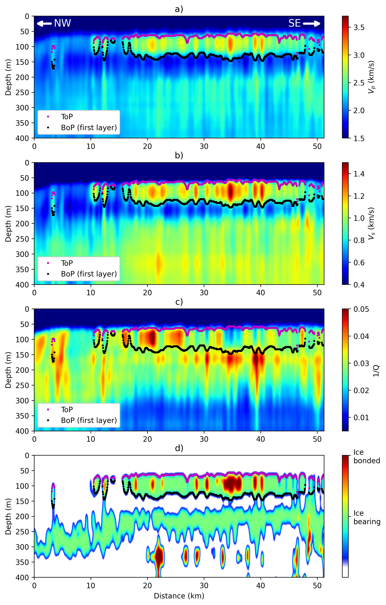
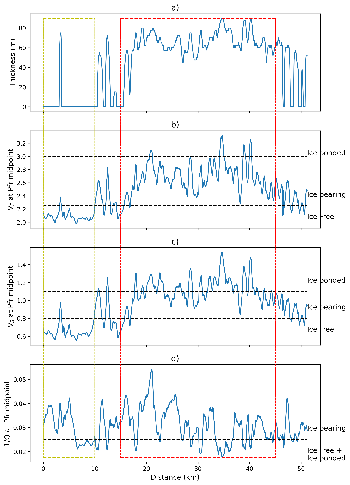
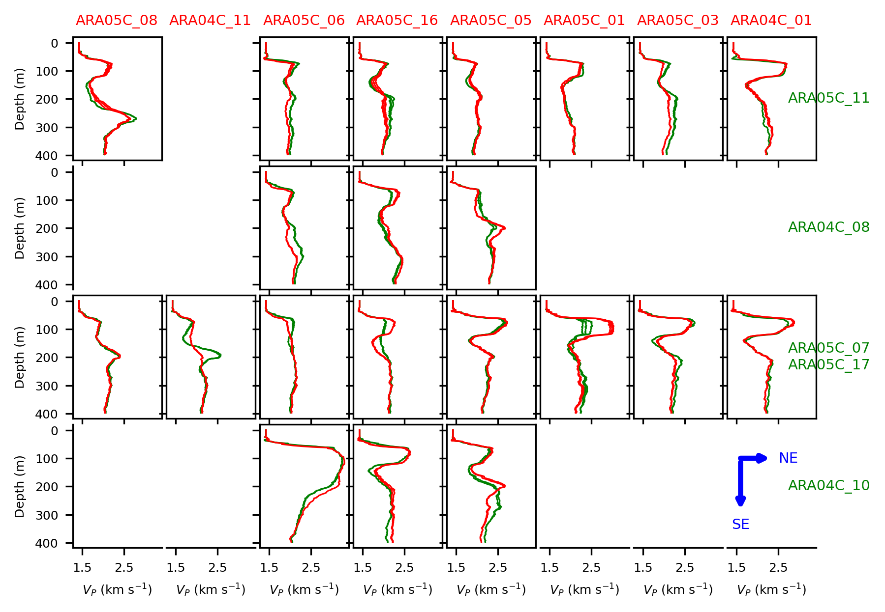
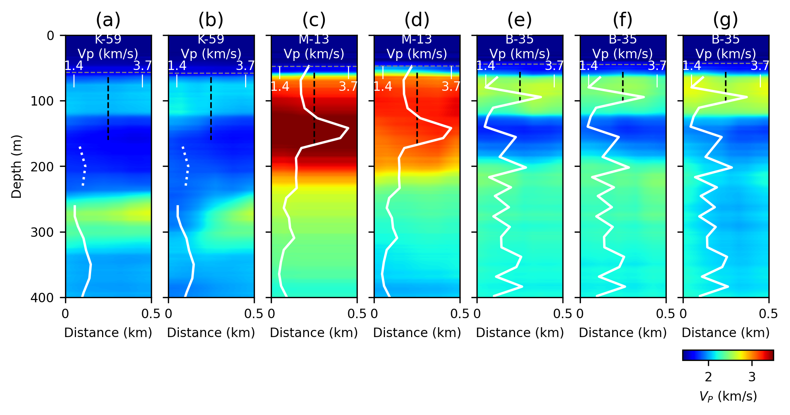

# Mapping Subsea Permafrost using deep learning

## Background
Mapping the distribution of subsea permafrost is a key step for understanding its potential impact on global warming. 
Although conventional seismic techniques have been used to determine the lateral extent of subsea permafrost, they are 
limited for evaluating its vertical variation in regional-scale mapping. However, the work of [Bustamante et al. 2024](#1) 
presented a deep learning approach that enebled the generation of more reliable and accurate velocity and attenuation 
models from seismic data using a multi-input multi-ouput NN and a transfer learning technique. 

This repository follows the code and results in "Mapping subsea permafrost distribution in the Canadian Beaufort Sea 
with marine seismic and deep learning" submitted to JGR: Solid Earth. This work extends the work of 
[Bustamante et al. 2024](#1) by evaluating the NN in 15 seismic lines from the ARA04C and ARA05C surveys in the Beaufort
Sea [(Kang et al. 2023)](#2). The distribution of the seismic lines is shown in the following figure:


In addition, following predefined thresholds, this repository calculate the permafrost distribution in all the seismic 
lines as described in the paper.


## Folder structure

The repository contains 4 folders aiming to store the required information (CheckpointsTL, DataPreprocessed, 
InvertedModels and SSPInterpretation) and 1 code folder. The data folders are as follows:

* `Checkpoints`: Store the last checkpoint on the TL methodology
* `Datapreprocessed`: Store de seismic lines aranged in CMPs. 
- The subfolder `CMPs_coords` saves the location files of the 
lines and the subfolder `MultiInput` save the seismic line data transformed in the 4 input domains
* `InvertedModels`: Store the inverted models after evaluating the 64 NN in the subfolder TL and the average of the Vp 
model
in the subfolder VP_models
* `SSPInterpretation`: Store the inverted velocity models after applying the defined thresholds

The coding folder contain the scrpts necessary for obtaining the results from the TL methodology applied to the seismic 
data. There are two main files to consider:

* `Evaluate.py`: Read the information on the Datapreprocessed folder and generate the MultiInput file if it does not 
exist. It also generates the output file in InvertedModels/TL subfolder
* `Sections_100mIsobath.py`: Generate the interpeted sections of permafrost distribution in the sesimic lines and store 
them in the folder SSPInterpretation. In addition, it saves the Average Vp velocity models in the subfolder 
InvertedModels/VP_models, and the permafrost parameters (top, bop, thickness, inveted values at the middle of the 
interpreted upper ssp layer, and the maximum Vp and Vs) and the interpreted permafrost distribution in the 
SSPInterpretation folder.

The requiements for running the scripts are summarized in the file requirements.txt. Note that the package GeoFlow is 
available in https://github.com/gfabieno/GeoFlow

In addition to the code and data, the `WellLogs` folder contains the crystal cable logs in wells Irkaluk B-35, Kopanoar 
M-13, and Nektoralik K-59 used in the paper. 


## Running the code

After locating the pre-processed seismic lines in the folder `Datapreprocessed`, the NN can be evaluated line by line as
follows:

```bash
cd code
python Evaluate.py -ln 05-06
```
Please change the line number option `-ln` to the desired seismic line. Choose between `['04-01', '04-02', '04-08', 
'04-09', '04-10', '04-11', '05-01', '05-03', '05-05', '05-06', '05-07', '05-08', '05-11', '05-12', '05-14', '05-15', 
'05-16', '05-17']`. 
Note that the input follows the (ARAC survey number - line number) format.

`Evaluate.py` reads the information from the folder `Datapreprocessed` and generates the MultiInput file if it does not
exist. It also generates the output file in `InvertedModels/TL` subfolder. The output file contains the average of the
inverted velocities and attenuations of the seismic line. Note that `Evaluate.py` can be run in parallel for all the 
seismic lines in the ARA04C and ARA05C surveys.

`Sections_100mIsobath.py` generates the interpeted sections of permafrost distribution in the 100m isobath for the 
evaluated sesimic lines and store them in the folder `SSPInterpretation`. In addition, it saves the Average Vp velocity 
models in the subfolder `InvertedModels/VP_models`, and the permafrost parameters (top, bop, thickness, inverted values 
at the middle of the interpreted upper ssp layer, and the maximum Vp and Vs) and the interpreted permafrost distribution 
in the SSPInterpretation folder. The script can be run as follows:

```bash
cd code
python Sections_100mIsobath.py -ln 05-06
```
Again, please change the line number option `-ln` to the desired seismic line.

`Sections_100mIsobath.py` will also generate the figures for the inverted parameters and upper permafrost layer 
interpretation as well as the resulting parameters at the mid-point of the upper permafrost layer. 





The prediction at the intersection between different seismic lines is shown in Figure 9. To reproduce this figure, run
* Figure 8: `python Figure_Intersects.py`


In addition, Figure 9 compared the inverted P-wave velocity models with crystal cable logs collected in wells close to
the seismic lines. To reproduce this figure, run
* Figure 9: `python Figure_WellLogs.py` 


The code also generate the corresponding `.sgy` file for each seismic line. The fence diagrams displayed on the paper 
can be easily visualized using 3D seismic visualization software such as OpendTect 
(https://www.opendtect.org/osr/Main/HomePage).

### Authors
Jefferson Bustamante Restrepo (Polytechnique Montreal, Geological Survey of Canada), <br />
Gabriel Fabien-Ouellet (Polytechnique Montreal), <br />
Mathieu Duchesne (Geological Survey of Canada), <br />
Amr Ibrahim (Polytechnique Montreal),

### References
<a id="1">[1]</a> 
Bustamante, J., Fabien-Ouellet, G., Duchesne, M. J., & Ibrahim, A. (2024). Deep-learning viscoelastic seismic inversion 
for mapping subsea permafrost. Geophysics, 89(4), R339-R353.

<a id="2">[2]</a> 
Kang Seung-Goo, Young Keun Jin, Jongkuk Hong, 2023. Geophysical data (multi channel seismic data) collected during the 
2013 ARA04C and 2014 ARA05C expeditions on the Beaufort sea. 
Available at: https://doi.org/10.22663/kopri-kpdc-00002217.1.