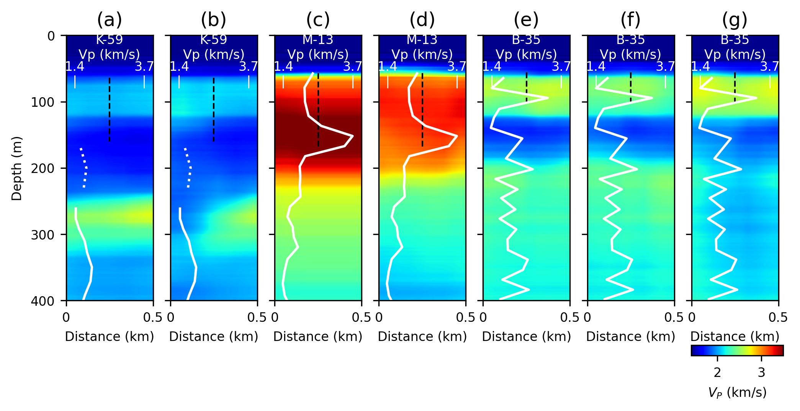

# Mapping Subsea Permafrost using deep learning

This repository provides the code and results in "Mapping subsea permafrost distribution in the Beaufort Sea with marine 
seismic and deep learning" submitted to JGR: Solid Earth

The repository contains 4 folders aiming to store the required information (CheckpointsTL, DataPreprocessed, InvertedModels 
and SSPInterpretation) and 1 code folder. The data folders are as follows:

* `Checkpoints`: Store the last checkpoint on the TL methodology
* `Datapreprocessed`: Store de seismic lines aranged in CMPs. 
- The subfolder `CMPs_coords` saves the location files of the 
lines and the subfolder `MultiInput` save the seismic line data transformed in the 4 input domains
* `InvertedModels`: Store the inverted models after evaluating the 64 NN in the subfolder TL and the average of the Vp 
model
in the subfolder VP_models
* `SSPInterpretation`: Store the inverted velocity models after applying the defined thresholds

The coding folder contain the scrpts necessary for obtaining the results from the TL methodology applied to the seismic 
data. There are two main files to consider:

* `Evaluate.py`: Read the information on the Datapreprocessed folder and generate the MultiInput file if it does not 
exist. It also generates the output file in InvertedModels/TL subfolder
* `Sections_100mIsobath.py`: Generate the interpeted sections of permafrost distribution in the sesimic lines and store 
them in the folder SSPInterpretation. In addition, it saves the Average Vp velocity models in the subfolder 
InvertedModels/VP_models.

The requiements for running the scripts are summarized in the file requirements.txt. Note that the package GeoFlow is 
available in https://github.com/gfabieno/GeoFlow

## Running the code

After locating the pre-processed seismic lines in the folder `Datapreprocessed`, the NN can be evaluated line by line as
follows:

```bash
cd code
python Evaluate.py -ln 05-06
```
Please change the line number option `-ln` to the desired seismic line. Choose between `['04-01', '04-02', '04-08', 
'04-09', '04-10', '04-11', '05-01', '05-03', '05-05', '05-06', '05-07', '05-08', '05-11', '05-12', '05-14', '05-15', 
'05-16', '05-17']`. 
Note that the input follows the (ARAC survey number - line number) format.

`Evaluate.py` reads the information from the folder `Datapreprocessed` and generates the MultiInput file if it does not
exist. It also generates the output file in `InvertedModels/TL` subfolder. The output file contains the average of the
inverted velocities and attenuations of the seismic line. Note that `Evaluate.py` can be run in parallel for all the 
seismic lines in the ARA04C and ARA05C surveys.

`Sections_100mIsobath.py` generates the interpeted sections of permafrost distribution in the 100m isobath for the 
evaluated sesimic lines and store them in the folder `SSPInterpretation`. In addition, it saves the Average Vp velocity 
models in the subfolder `InvertedModels/VP_models`. The script can be run as follows:

```bash
cd code
python Sections_100mIsobath.py -ln 05-06
```
Again, please change the line number option `-ln` to the desired seismic line.


## Figures

Figures 4-8 in the paper can be reproduced by running the following scripts:

* Figure 4: `python Figure_Parallel_lines_1.py`
* Figure 5: `python Figure_Parallel_lines_2.py`
* Figure 6: `python Figure_Orthogonal_lines.py`
* Figure 7: `python Figure_Intersects.py`
* Figure 8: `python Figure_WellLogs.py` 




### Authors
Jefferson Bustamante Restrepo (Polytechnique Montreal, Geological Survey of Canada), <br />
Gabriel Fabien-Ouellet (Polytechnique Montreal), <br />
Mathieu Duchesne (Geological Survey of Canada), <br />
Amr Ibrahim (Polytechnique Montreal),